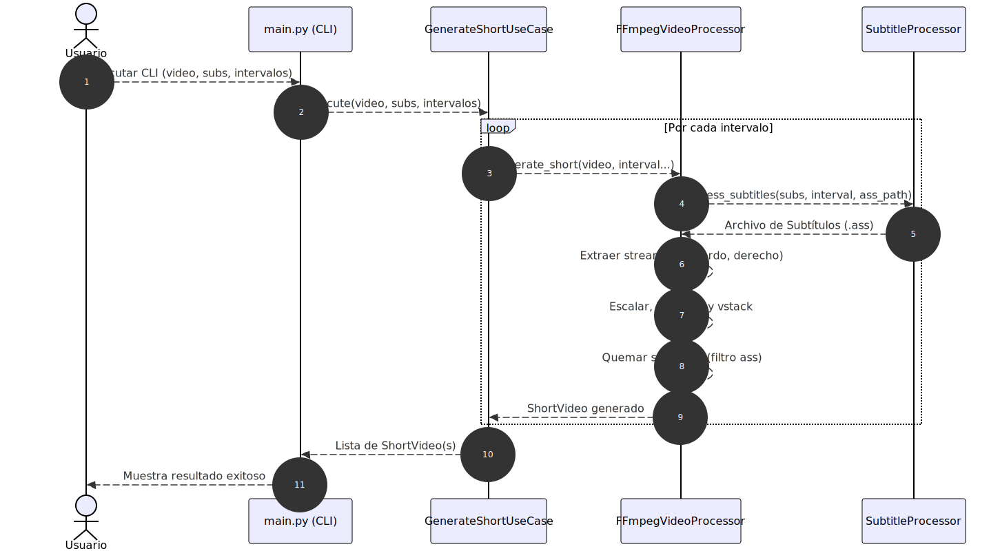
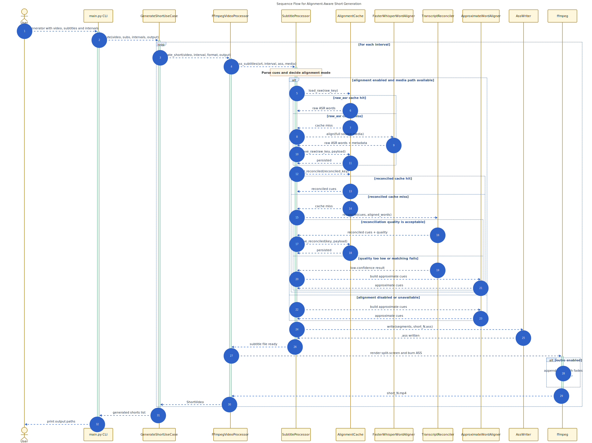

# Podcast Short Video Generator

[](https://www.python.org/downloads/release/python-3100/)
[](https://github.com/psf/black)

Aplicación en Python para generar automáticamente clips cortos de vídeo a partir de episodios de podcast usando
segmentación basada en subtítulos y procesamiento FFmpeg

Esta aplicación permite tomar un video `.mp4` horizontal, un archivo de subtítulos asociado (por ejemplo, SRT o VTT) y
generar videos verticales en formato de YouTube Shorts utilizando intervalos de tiempo especificados.

**Nuevas características:**

- **Formato Vertical de Pantalla Dividida**: Automáticamente recorta las mitades izquierda y derecha del video original
y las apila verticalmente para llenar el formato 9:16.
- **Subtítulos estilo Karaoke Progresivo**: Genera subtítulos dinámicos donde las palabras se resplandecen de manera
secuencial de acuerdo al audio.
- **Alineación Real de Palabras**: Usa `faster-whisper` para obtener timestamps por palabra cuando está disponible,
reutiliza caché local en dos niveles (`raw_asr` + `reconciled`) y mantiene fallback al timing aproximado si la
alineación falla o no es confiable.

Está construida nativamente en Python utilizando los principios de **Diseño Orientado al Dominio (DDD)** y **Desarrollo
Guiado por Pruebas (TDD)**.

---

## Índice

1. [Requisitos previos](#requisitos-previos)
2. [Instalación y Configuración](#instalación-y-configuración)
3. [Uso del Aplicativo](#uso-del-aplicativo)
   - [Estructura de Archivos Recomendada](#estructura-de-archivos-recomendada)
   - [Personalización](#personalización)
   - [Formato del JSON de Intervalos](#formato-del-json-de-intervalos)
   - [Ejecutar el Generador](#ejecutar-el-generador)
4. [Arquitectura del Proyecto](#arquitectura-del-proyecto)
5. [Flujo de Ejecución (Diagrama de Uso)](#flujo-de-ejecución-diagrama-de-uso)
6. [Flujo de Ejecución (Diagrama de Secuencia)](#flujo-de-ejecución-diagrama-de-secuencia)
7. [Desarrollo y Pruebas](#desarrollo-y-pruebas)
   - [Pruebas Unitarias](#pruebas-unitarias)
   - [Pruebas de Mutación](#pruebas-de-mutación)
8. [Contribución (Linting y Segurización)](#contribución-linting-y-segurización)
   - [Cómo Contribuir](#cómo-contribuir)
9. [Licencia](#licencia)

---

## Requisitos previos

- Python 3.10+ para la ejecucion del generador.
- Python 3.11 o 3.12 recomendado si quieres correr toda la bateria de calidad local, especialmente `mutmut`.
- `ffmpeg` instalado a nivel de sistema (requisito indispensable para `ffmpeg-python`).

## Instalación y Configuración

Se recomienda fuertemente el uso de un entorno virtual (Virtual Environment) para evitar conflictos de dependencias con
el sistema operativo.

1. **Clonar o descargar el proyecto e ingresar al directorio:**

   ```bash
   cd podcast-short-video-generator
   ```

2. **Crear el entorno virtual:**

   ```bash
   python3 -m venv venv
   ```

3. **Activar el entorno virtual:**
   - En Linux/macOS:
     ```bash
     source venv/bin/activate
     ```
   - En Windows:
     ```bash
     venv\Scripts\activate
     ```

4. **Instalar las dependencias del proyecto:**
   ```bash
   pip install -r requirements.txt
   ```

   `requirements.txt` incluye tanto las dependencias de runtime como las de calidad usadas por CI:
   `faster-whisper`, `pytest`, `pytest-cov`, `mutmut`, `vulture` y `pylint`.

### Alineación palabra-audio

El pipeline de subtítulos intenta alinear palabras sobre el media original antes de generar el `.ass` karaoke.

- Si `faster-whisper` está disponible y la alineación es válida, el sistema usa timings reconciliados con el SRT.
- Si la alineación falla, no hay dependencia instalada o la calidad es baja, el proceso vuelve automáticamente al
  cálculo aproximado actual.
- La primera alineación de un media puede tardar más porque `faster-whisper` necesita cargar el modelo y generar el
  ASR bruto del archivo completo.
- La caché se guarda junto al output:

```text
outputs/.cache/subtitle_alignment/
├── raw_asr/
└── reconciled/
```

`raw_asr/` almacena el ASR bruto del media completo. `reconciled/` almacena el resultado derivado de reconciliar ese
ASR con el subtítulo original. Así se evita recalcular tanto la transcripción como el matching en ejecuciones
repetidas del mismo source media.

La invalidez de caché ocurre de forma automática si cambia alguno de estos fingerprints:

- media source (`path`, `size_bytes`, `mtime_ns`)
- archivo de subtítulos (`path`, `size_bytes`, `mtime_ns`, `sha256`)
- backend/modelo/configuración de alineación
- versión de reconciliación

---

## Uso del Aplicativo

La aplicación expone una interfaz de línea de comandos (CLI) lista para ser utilizada. Toma un único video y su archivo
de subtítulos para generar múltiples cortos a partir de él basándose en un archivo JSON.

### Estructura de Archivos Recomendada

Para mantener el orden, se sugiere tener una carpeta de entrada y una de salida en la raíz del proyecto (o donde lo
vayas a ejecutar):

```text
podcast-short-video-generator/
├── inputs/
│   ├── mi_video_podcast.mp4      <-- Video original (horizontal)
│   ├── mi_video_podcast.srt      <-- Subtítulos completos del video
│   └── recortes.json             <-- Configuración de tiempos
├── outputs/                      <-- Aquí se generarán los Shorts
├── src/
├── main.py
...
```

### Personalización

El proyecto incluye en su raíz un archivo `config.json` que permite personalizar la apariencia visual de los subtítulos
generados:

```json
{
  "brand_colors": ["#e61b8e", "#d1ff02", "#26f4ff", "#ffe81f"],
  "alignment": {
    "backend": "faster_whisper",
    "compute_type": "int8",
    "enabled": true,
    "model_size": "base",
    "vad_filter": true
  },
  "subtitles": {
    "active_border_color_hex": "#000000",
    "base_border_color_hex": "#000000",
    "base_color_hex": "#FFFFFF",
    "font_name": "Montserrat",
    "font_size": 95,
    "y_position": 1050
  }
}
```

- **`brand_colors`**: Una lista de colores (en formato Hex) que se utilizarán aleatoriamente para iluminar las palabras
a medida que se pronuncian en el modo "karaoke".
- **`alignment`**:
  - `backend`: Backend de alineación. MVP: `faster_whisper`.
  - `compute_type`: Modo de cómputo del backend.
  - `enabled`: Activa o desactiva la alineación real.
  - `model_size`: Tamaño del modelo ASR.
  - `vad_filter`: Activa filtrado de voz antes del cálculo de timestamps.
- **`subtitles`**:
  - `base_color_hex`: El color base inactivo del texto.
  - `font_name`: El nombre de la fuente tipográfica a utilizar.
  - `font_size`: El tamaño de la fuente.
  - `active_border_color_hex`: El color del contorno de la palabra iluminada.
  - `y_position`: La posición vertical (eje Y) donde se centrarán los subtítulos en un lienzo de 1080x1920.

### Formato del JSON de Intervalos
Por defecto, **(`inputs/recortes.json`)**

Para definir múltiples segmentos del video original que se van a convertir en "Shorts", el archivo JSON debe contener un
arreglo de objetos. Cada objeto debe tener la clave `"time"` con formato `"MM:SS - MM:SS"`.

Cada objeto en este array resultará en la creación de un Short independiente en la carpeta de salida.

```json
[
  { "time": "00:10 - 00:20" },
  { "time": "05:30 - 06:15" },
  { "time": "12:00 - 13:00" }
]
```

_(En este ejemplo, se generarán 3 Shorts distintos a partir del mismo video)._

### Ejecutar el Generador

Si colocas tus archivos con los nombres por defecto en la carpeta `inputs/` (`video.mp4`, `video.srt`, `recortes.json`),
puedes ejecutar el comando principal de forma muy sencilla:

```bash
python main.py
```

O especificando tus propias rutas, en caso de tener nombres diferentes:

```bash
python main.py \
  --video inputs/mi_video_podcast.mp4 \
  --subs inputs/mi_video_podcast.srt \
  --intervals inputs/recortes.json \
  --output outputs/
```

Para activar el outro opcional (bajo demanda) y aplicar transición suave:

```bash
python main.py \
  --video inputs/mi_video_podcast.mp4 \
  --subs inputs/mi_video_podcast.srt \
  --intervals inputs/recortes.json \
  --output outputs/ \
  --enable-outro \
  --outro inputs/outroShort.mp4 \
  --fade-duration 0.7
```

Para ejecutar el flujo completo con los archivos por defecto del repo, usando sincronización real por palabra con
`faster-whisper` (si `config.json` mantiene `alignment.enabled=true` y `backend=faster_whisper`) y outro con fade de
`0.6` segundos:

```bash
python main.py \
  --enable-outro \
  --outro inputs/outroShort.mp4 \
  --fade-duration 0.6
```

#### Argumentos:

- `--video`: (Opcional) Ruta al video horizontal base (por defecto: `inputs/video.mp4`).
- `--subs`: (Opcional) Ruta al archivo de subtítulos correspondiente (por defecto: `inputs/video.srt`).
- `--intervals`: (Opcional) Ruta al archivo JSON con los intervalos deseados (por defecto: `inputs/recortes.json`).
- `--output`: (Opcional) Carpeta donde se guardarán los resultados (por defecto: `outputs`).
- `--enable-outro`: (Opcional) Habilita la adición de outro al final de cada short generado.
- `--outro`: (Opcional) Ruta del video de outro usado cuando `--enable-outro` está activo (por defecto: `inputs/outroShort.mp4`).
- `--fade-duration`: (Opcional) Duración en segundos del fade de transición short/outro (por defecto: `0.7`).

> Si `--enable-outro` está activo y el archivo de outro no existe, la aplicación continúa generando los shorts sin outro y muestra un `Warning` en consola.

#### ¿Dónde se generan los Shorts?

Los videos resultantes se guardarán en la ruta especificada en `--output` (en el ejemplo: carpeta `outputs/`).
Se nombrarán secuencialmente como `short_0.mp4`, `short_1.mp4`, `short_2.mp4` en base al orden de los elementos del
JSON.

---

## Arquitectura del Proyecto

El proyecto sigue la metodología **Clean Architecture**, dividiendo responsabilidades y facilitando la escalabilidad
(por ejemplo, escalar de `ffmpeg` a procesadores en la nube sin afectar la lógica de negocio).



Fuente Mermaid: `docs/architecture.mmd`

- **Capa de Dominio (`src/domain`)**: Contiene las Entidades (`Video`, `ShortVideo`), los Objetos de Valor
(`TimeInterval`, `VideoFormat`), las Interfaces (`IVideoProcessor`) y los modelos inmutables de subtítulos
(`SubtitleCue`, `AlignedWord`, `ReconciledWord`, `ReconciledCue`).
- **Capa de Aplicación (`src/application`)**: Contiene el Caso de Uso principal `GenerateShortUseCase` encargado de la
orquestación.
- **Capa de Infraestructura (`src/infrastructure`)**: Implementa `FFmpegVideoProcessor` acoplándose a `ffmpeg-python`,
`SubtitleProcessor` como facade del pipeline de subtítulos, `ConfigManager` para administrar `config.json` y el paquete
`src/infrastructure/subtitles/` con componentes desacoplados para parseo, alineación, reconciliación, proyección por
intervalo, caché en dos niveles y escritura del `.ass`.
- **Interfaces (`main.py`)**: Valida argumentos y llama al caso de uso inyectando las dependencias.

El pipeline de subtítulos ahora queda separado en responsabilidades estables:

- `SubtitleParser`: parsea el SRT hacia cues de dominio.
- `FasterWhisperWordAligner`: genera word timestamps reales sobre el media completo.
- `AlignmentCache`: persiste `raw_asr` y `reconciled`.
- `TranscriptReconciler`: preserva el texto del subtítulo original y le asigna timing real cuando la calidad lo permite.
- `ApproximateWordAligner`: fallback explicito si la alineación falla o no es confiable.
- `IntervalSubtitleProjector`: recorta y desplaza tiempos al intervalo del short.
- `AssWriter`: mantiene el render karaoke en `.ass`.

---

## Flujo de Ejecución (Diagrama de Uso)

A continuación se detalla cómo el usuario a través de la CLI llama al sistema, y cómo interactúan las capas internas
para generar el output de forma escalonada e independiente.



Fuente Mermaid: `docs/usage.mmd`

---

## Flujo de Ejecución (Diagrama de Secuencia)

Este diagrama enfatiza el orden temporal entre la CLI, el caso de uso, el pipeline de subtítulos, la caché de
alineación y el render final. Es la vista más útil para entender cuándo se reutiliza `raw_asr`, cuándo se reconcilia y
cuándo se activa el fallback aproximado.



Fuente Mermaid: `docs/usage-sequence.mmd`

---

## Desarrollo y Pruebas

El aplicativo fue creado utilizando **Domain-Driven Design (DDD)** y **Test-Driven Development (TDD)**. Esto asegura la
máxima calidad sobre las validaciones de tiempo y escalabilidad.

### Pruebas Unitarias

Para correr la suite unitaria con el mismo gate principal que usa CI:

```bash
pytest tests/ --cov=src --cov-report=term-missing --cov-branch --cov-fail-under=90
```

### Pruebas de Mutación

Para asegurar que nuestros tests no solo cubran el código, sino que sean **efectivos** detectando errores, utilizamos
**Mutation Testing** con la herramienta `mutmut`.

A diferencia de la cobertura tradicional, las pruebas de mutación introducen pequeños cambios (mutaciones) en el código
fuente para verificar si los tests existentes son capaces de detectarlos y fallar. Si un test falla al detectar un
cambio, el mutante ha sido "asesinado" (lo cual es bueno). Si el test pasa a pesar del cambio, el mutante "sobrevive"
(indicando que el test es débil).

#### Ejecución

1. **Ejecutar el análisis de mutación** (esto puede tardar varios minutos):

   ```bash
   mutmut run --CI --no-progress --simple-output
   ```

   _Nota:_ `mutmut<3` no es estable en Python 3.14. Para correr esta validación localmente se recomienda un entorno
   con Python 3.11 o 3.12, o delegar la corrida completa al workflow de CI.

2. **Generar el reporte visual (HTML)**:
   Una vez terminada la ejecución, genera un reporte legible:

   ```bash
   mutmut html
   ```

3. **Ver los resultados**:
   El comando anterior crea una carpeta llamada `html/` en la raíz del proyecto. Para ver el reporte detallado, abre el
archivo:
   - **`html/index.html`** en tu navegador favorito.

### Calidad estática

Los checks adicionales del repo que también se ejecutan en CI son:

```bash
vulture src --min-confidence 80
pylint src tests --disable=all --enable=duplicate-code --min-similarity-lines=12
pre-commit run --all-files
```

El hook local `branch-name-check` exige ramas con este patrón:

```text
feature/EWS-<ticket>-descripcion-corta
```

---

## Contribución (Linting y Segurización)

Este proyecto utiliza `pre-commit` para asegurar la calidad del código, el formato y evitar la subida accidental de
credenciales antes de cada commit.

1. **Instalar los hooks de pre-commit** (Solo la primera vez, con el entorno virtual activado):

   ```bash
   pre-commit install
   ```

2. **(Opcional) Ejecutar pre-commit manualmente en todos los archivos**:
   ```bash
   pre-commit run --all-files
   ```

Las herramientas integradas incluyen:

- **Black**: Para el formateo automático del código.
- **Ruff**: Como linter rápido y moderno de Python.
- **Isort**: Para ordenar las importaciones.
- **Pylint (`no-self-use`)**: Para detectar métodos que pueden ser estáticos.
- **Vulture**: Para detectar código muerto.
- **Detect-secrets**: Para prevenir commits con contraseñas o claves expuestas.
- **Branch name check**: Para forzar el patrón de naming compatible con los workflows del repo.

### Cómo Contribuir

¡Las contribuciones son bienvenidas! Sigue estos pasos para colaborar:

1. Haz un **Fork** del repositorio.
2. Crea una rama para tu nueva característica o solución siguiendo el patrón del repo:
   `git checkout -b feature/EWS-<ticket>-descripcion-corta`.
3. Asegúrate de ejecutar al menos:
   - `pytest tests/ --cov=src --cov-report=term-missing --cov-branch --cov-fail-under=90`
   - `pre-commit run --all-files`
   - `vulture src --min-confidence 80`
   - `pylint src tests --disable=all --enable=duplicate-code --min-similarity-lines=12`
4. Haz tus commits describiendo claramente los cambios.
5. Abre un **Pull Request** explicando qué hace tu código y por qué debería integrarse.

---

## Licencia

Este proyecto está bajo la Licencia MIT. Consulta el archivo [LICENSE](LICENSE) para más detalles.
