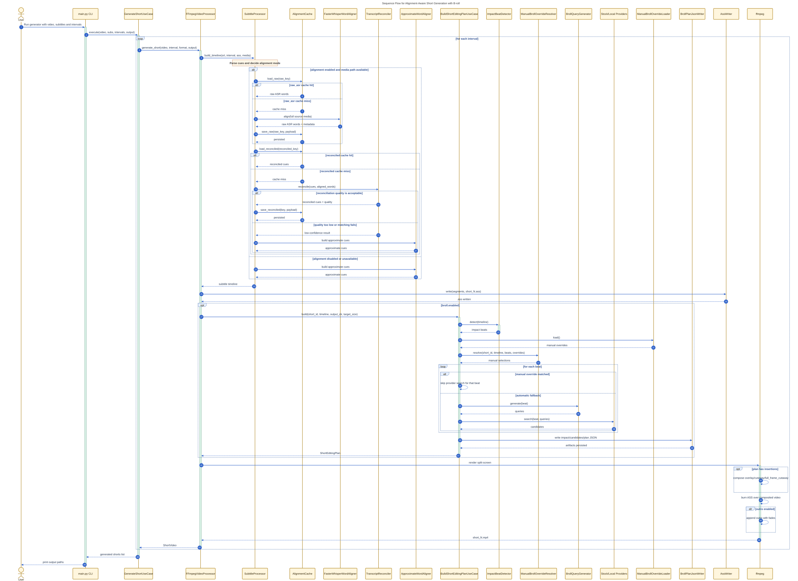

# Podcast Short Video Generator

[](https://www.python.org/downloads/release/python-3100/)
[](https://github.com/psf/black)

Aplicación en Python para generar automáticamente clips cortos de vídeo a partir de episodios de podcast usando
segmentación basada en subtítulos y procesamiento FFmpeg

Esta aplicación permite tomar un video `.mp4` horizontal, un archivo de subtítulos asociado (por ejemplo, SRT o VTT) y
generar videos verticales en formato de YouTube Shorts utilizando intervalos de tiempo especificados.

**Nuevas características:**

- **Formato Vertical de Pantalla Dividida**: Automáticamente recorta las mitades izquierda y derecha del video original
y las apila verticalmente para llenar el formato 9:16.
- **Subtítulos estilo Karaoke Progresivo**: Genera subtítulos dinámicos donde las palabras se resplandecen de manera
secuencial de acuerdo al audio.
- **Alineación Real de Palabras**: Usa `faster-whisper` para obtener timestamps por palabra cuando está disponible,
reutiliza caché local en dos niveles (`raw_asr` + `reconciled`) y mantiene fallback al timing aproximado si la
alineación falla o no es confiable.

Está construida nativamente en Python utilizando los principios de **Diseño Orientado al Dominio (DDD)** y **Desarrollo
Guiado por Pruebas (TDD)**.

---

## Índice

1. [Requisitos previos](#requisitos-previos)
2. [Instalación y Configuración](#instalación-y-configuración)
3. [Uso del Aplicativo](#uso-del-aplicativo)
   - [Estructura de Archivos Recomendada](#estructura-de-archivos-recomendada)
   - [Personalización](#personalización)
   - [Formato del JSON de Intervalos](#formato-del-json-de-intervalos)
   - [Ejecutar el Generador](#ejecutar-el-generador)
4. [Arquitectura del Proyecto](#arquitectura-del-proyecto)
5. [Flujo de Ejecución (Diagrama de Uso)](#flujo-de-ejecución-diagrama-de-uso)
6. [Flujo de Ejecución (Diagrama de Secuencia)](#flujo-de-ejecución-diagrama-de-secuencia)
7. [Desarrollo y Pruebas](#desarrollo-y-pruebas)
   - [Pruebas Unitarias](#pruebas-unitarias)
   - [Pruebas de Mutación](#pruebas-de-mutación)
8. [Contribución (Linting y Segurización)](#contribución-linting-y-segurización)
   - [Cómo Contribuir](#cómo-contribuir)
9. [Licencia](#licencia)

---

## Requisitos previos

- Python 3.10+ para la ejecución del generador.
- Python 3.11 o 3.12 recomendados si quieres correr toda la bateria de calidad local, especialmente `mutmut`.
- `ffmpeg` instalado a nivel de sistema (requisito indispensable para `ffmpeg-python`).

## Instalación y Configuración

Se recomienda fuertemente el uso de un entorno virtual (Virtual Environment) para evitar conflictos de dependencias con
el sistema operativo.

1. **Clonar o descargar el proyecto e ingresar al directorio:**

   ```bash
   cd podcast-short-video-generator
   ```

2. **Crear el entorno virtual:**

   ```bash
   python3 -m venv venv
   ```

3. **Activar el entorno virtual:**
   - En Linux/macOS:
     ```bash
     source venv/bin/activate
     ```
   - En Windows:
     ```bash
     venv\Scripts\activate
     ```

4. **Instalar las dependencias del proyecto:**
   ```bash
   pip install -r requirements.txt
   ```

   `requirements.txt` incluye tanto las dependencias de runtime como las de calidad usadas por CI:
   `faster-whisper`, `pytest`, `pytest-cov`, `mutmut`, `vulture` y `pylint`.

### Alineación palabra-audio

El pipeline de subtítulos intenta alinear palabras sobre él media original antes de generar el `.ass` karaoke.

- Si `faster-whisper` está disponible y la alineación es válida, el sistema usa timings reconciliados con el SRT.
- Si la alineación falla, no hay dependencia instalada o la calidad es baja, el proceso vuelve automáticamente al
  cálculo aproximado actual.
- La primera alineación de un medio puede tardar más porque `faster-whisper` necesita cargar el modelo y generar el
  ASR bruto del archivo completo.
- La caché se guarda junto al output:

```text
outputs/.cache/subtitle_alignment/
├── raw_asr/
└── reconciled/
```

`raw_asr/` almacena el ASR bruto del medio completo. `reconciled/` almacena el resultado derivado de reconciliar ese
ASR con el subtítulo original. Así se evita recalcular tanto la transcripción como el matching en ejecuciones
repetidas del mismo source media.

La invalidez de caché ocurre de forma automática si cambia alguno de estos fingerprints:

- media source (`path`, `size_bytes`, `mtime_ns`)
- archivo de subtítulos (`path`, `size_bytes`, `mtime_ns`, `sha256`)
- backend/modelo/configuración de alineación
- versión de reconciliación

---

## Uso del Aplicativo

La aplicación expone una interfaz de línea de comandos (CLI) lista para ser utilizada. Toma un único video y su archivo
de subtítulos para generar múltiples cortos a partir de él basándose en un archivo JSON.

### Estructura de Archivos Recomendada

Para mantener el orden, se sugiere tener una carpeta de entrada y una de salida en la raíz del proyecto (o donde lo
vayas a ejecutar):

```text
podcast-short-video-generator/
├── inputs/
│   ├── mi_video_podcast.mp4      <-- Video original (horizontal)
│   ├── mi_video_podcast.srt      <-- Subtítulos completos del video
│   └── recortes.json             <-- Configuración de tiempos
├── outputs/                      <-- Aquí se generarán los Shorts
├── src/
├── main.py
...
```

### Personalización

El proyecto incluye en su raíz un archivo `config.json` que permite personalizar la apariencia visual de los subtítulos
generados:

```json
{
  "brand_colors": ["#e61b8e", "#d1ff02", "#26f4ff", "#ffe81f"],
  "alignment": {
    "backend": "faster_whisper",
    "compute_type": "int8",
    "enabled": true,
    "model_size": "base",
    "vad_filter": true
  },
  "broll": {
    "enabled": true,
    "beat_score_threshold": 0.68,
    "cutaway_score_threshold": 0.82,
    "min_gap_ms": 4500,
    "overlay_top_y": 120,
    "local_search_dirs": [
      "inputs/broll/library"
    ],
    "overrides_filepath": "inputs/broll-overrides.json"
  },
  "subtitles": {
    "active_border_color_hex": "#000000",
    "base_border_color_hex": "#000000",
    "base_color_hex": "#FFFFFF",
    "font_name": "Montserrat",
    "font_size": 95,
    "y_position": 1050
  }
}
```

- **`brand_colors`**: Una lista de colores (en formato Hex) que se utilizarán aleatoriamente para iluminar las palabras
a medida que se pronuncian en el modo "karaoke".
- **`alignment`**:
  - `backend`: Backend de alineación. MVP: `faster_whisper`.
  - `compute_type`: Modo de cómputo del backend.
  - `enabled`: Activa o desactiva la alineación real.
  - `model_size`: Tamaño del modelo ASR.
  - `vad_filter`: Activa filtrado de voz antes del cálculo de timestamps.
- **`broll`**:
  - `enabled`: Activa el pipeline de B-roll. En el estado actual del repo viene activado por defecto.
  - `beat_score_threshold`: Score mínimo para considerar un beat visualmente reforzable.
  - `cutaway_score_threshold`: Score mínimo para permitir una inserción a pantalla completa.
  - `min_gap_ms`: Distancia mínima entre inserciones dentro de un mismo short.
  - `overlay_top_y`: Posición "Y" inicial de overlays para evitar conflicto con subtítulos.
  - `local_search_dirs`: Carpetas opcionales con una librería local de medios para fallback de B-roll.
  - `overrides_filepath`: Ruta opcional al archivo de overrides manuales. Si se omite, se usa `inputs/broll-overrides.json`.
- **`subtitles`**:
  - `base_color_hex`: El color base inactivo del texto.
  - `font_name`: El nombre de la fuente tipográfica a utilizar.
  - `font_size`: El tamaño de la fuente.
  - `active_border_color_hex`: El color del contorno de la palabra iluminada.
  - `y_position`: La posición vertical (eje Y) donde se centrarán los subtítulos en un lienzo de 1080x1920.

### B-roll automático

El pipeline puede detectar beats de alto impacto a partir del transcript alineado y construir un plan intermedio de
edición antes del render final.

- Si `broll.enabled=false`, el flujo sigue exactamente igual que antes.
- Si `broll.enabled=true`, el sistema intenta:
  - detectar beats visualmente reforzables
  - resolver primero overrides manuales por `short_id + anchor_text`
  - buscar assets en proveedores gratuitos
  - generar `overlay`, `cutaway` o `full_frame_cutaway`
  - renderizar el short con B-roll sin tapar subtítulos
- El repo ya incluye un `inputs/broll-overrides.json` de ejemplo activo para `short_2`.
- El repo ya incluye una libreria local base en `inputs/broll/library` con `broll-metadata.json`.
- Si falla la detección, la búsqueda o la descarga de assets, el short se sigue generando sin B-roll.
- Si un override manual apunta a un video con audio, el pipeline ignora siempre ese audio y conserva el audio original del short.

#### Proveedores soportados

- `Pexels`: requiere `PEXELS_API_KEY` en `.env` o en variables de entorno del sistema.
- `Pixabay`: requiere `PIXABAY_API_KEY` en `.env` o en variables de entorno del sistema.
- `local_search_dirs`: libreria local para imágenes y videos (`.jpg`, `.jpeg`, `.png`, `.webp`, `.mp4`, `.mov`, `.webm`, `.m4v`).

#### Como se puntua un candidato de B-roll

Cada asset encontrado no se usa directamente. Primero recibe un `total_score` entre `0.0` y `1.0` en
`src/application/broll/broll_candidate_ranker.py`.

Formula actual:

```text
total_score =
  0.40 * semantic_match +
  0.20 * visual_fit +
  0.15 * duration_fit +
  0.10 * orientation_fit +
  0.10 * diversity_bonus +
  0.05 * technical_quality
```

Interpretacion de cada subscore:

- `semantic_match`: cuanto coincide el significado del beat con el asset. Se calcula comparando tokens del beat y de
  las queries contra `title`, `tags`, `description` y nombre del archivo. Es el factor mas importante.
- `visual_fit`: premia que el asset sea video y que encaje bien en vertical.
- `duration_fit`: mide si el clip sirve para cubrir la duracion del beat. Si el video dura lo suficiente, puntua alto.
- `orientation_fit`: vuelve a valorar la orientacion. `vertical` puntua mejor que `square`, y `square` mejor que
  `landscape`.
- `diversity_bonus`: pequeño bonus cuando el asset trae metadata util, sobre todo `tags`.
- `technical_quality`: valora la resolucion. Pesa poco frente al match semantico.

Ejemplo simplificado:

```text
semantic_match = 0.75
visual_fit = 0.95
duration_fit = 1.00
orientation_fit = 1.00
diversity_bonus = 0.10
technical_quality = 0.40

total_score = 0.77
```

Importante: `total_score` no significa automaticamente "usar este video". El planner aplica despues filtros minimos
adicionales en `src/application/broll/broll_insertion_planner.py`.

Minimos actuales:

- `minimum_candidate_score = 0.55`
- `automatic_candidate_semantic_match_threshold = 0.30`
- `support_candidate_semantic_match_threshold = 0.45`

Eso significa:

- un candidato puede tener `total_score` aceptable y aun asi quedar fuera si el `semantic_match` es flojo
- los `support beats` exigen un match semantico mas estricto que los beats fuertes
- este filtro extra evita inserciones incoherentes por palabras incidentales, por ejemplo elegir un clip solo porque
  comparte un token aislado como `birds`

#### Variables sensibles

No guardes API keys en `config.json`, porque ese archivo está versionado dentro del repo. Usa un archivo `.env`
local basado en `.env.example`:

```bash
cp .env.example .env
```

```dotenv
PEXELS_API_KEY=tu_clave
PIXABAY_API_KEY=tu_clave
```

El proyecto carga `.env` automaticamente al inicializar `ConfigManager`.

#### Como funciona la libreria local de medios

`local_search_dirs` no apunta a un archivo concreto, sino a una o varias carpetas con clips e imágenes reutilizables.
La forma recomendada de curar esa libreria es agregar un archivo `broll-metadata.json` en la raiz de cada carpeta.
Si existe ese manifest, el selector local usa esa metadata como fuente primaria y no depende del nombre del archivo.

Ejemplo:

```json
{
  "version": 1,
  "assets": [
    {
      "path": "money/budget-crash-vertical.mp4",
      "title": "Budget crash phone feed",
      "tags": ["budget", "crash", "finance", "market"],
      "description": "Vertical phone clip showing a market drop.",
      "asset_type": "video",
      "orientation": "vertical",
      "active": true
    },
    {
      "path": "city/night-street.png",
      "title": "Night city street",
      "tags": ["city", "street", "urban", "night"],
      "description": "Still image for urban atmosphere.",
      "asset_type": "image",
      "orientation": "square",
      "active": true
    }
  ]
}
```

El repo ya trae una base curada para empezar a probar sin preparar una libreria desde cero

Los clips incluidos cubren escenas de naturaleza, ciudad, tráfico, nieve, escritura, oficina, cementerio, protesta,
emoción, reflexion y trabajo en equipo para que el fallback local ya tenga material reutilizable desde el primer run.

El matching local con manifest:

- tokeniza el beat detectado y las queries generadas
- tokeniza `title`, `tags` y `description` de cada asset
- prioriza assets con mejor intersección semantica
- ignora entradas inactivas o cuyo archivo no exista

Solo si un root de `local_search_dirs` no tiene `broll-metadata.json`, el sistema cae al fallback heurístico por nombre
de archivo y carpetas.

Ejemplos de nombres utiles:

- `inputs/broll/money/budget-crash.mp4`
- `inputs/broll/office/phone-screen-vertical.mp4`
- `inputs/broll/city/night-street.png`

Si en el nombre aparece `vertical`, `portrait`, `reel`, `short` o `9x16`, el selector asume que ese asset local ya
está mejor preparado para `overlay` o `cutaway` vertical.

#### Overrides manuales por short

Cuando quieras forzar un asset concreto para una frase puntual, puedes agregar `inputs/broll-overrides.json`.
Este archivo se evalúa antes de la búsqueda automática y permite usar videos locales curados sin depender del score del
detector.

Ejemplo:

```json
{
  "version": 1,
  "overrides": [
    {
      "short_id": "short_2",
      "anchor_text": "job interview",
      "asset_path": "../ejemploBroll1.mp4",
      "mode": "full_frame_cutaway",
      "start_ms": 460,
      "end_ms": 1800,
      "mute_asset_audio": true,
      "priority": 200
    },
    {
      "short_id": "short_2",
      "anchor_text": "grave",
      "asset_path": "../ejemploBroll.mp4",
      "mode": "full_frame_cutaway",
      "start_ms": 9280,
      "end_ms": 12400,
      "mute_asset_audio": true,
      "priority": 200
    }
  ]
}
```

Reglas de este archivo:

- `short_id`: nombre del short objetivo, por ejemplo `short_2`
- `anchor_text`: texto o subfrase a matchear contra beats detectados o directamente contra el timeline real
- `asset_path`: ruta absoluta o relativa al propio `broll-overrides.json`
- `mode`: en esta fase se recomienda `full_frame_cutaway`
- `start_ms` / `end_ms`: opcionales; si no se informan, el sistema usa el timing real del beat
- `mute_asset_audio`: se conserva por claridad editorial, pero el renderer ignora siempre el audio del asset
- `priority`: resuelve conflictos cuando dos overrides compiten por el mismo beat

Si un override no encuentra beat compatible o el archivo no existe, el pipeline cae al flujo automático sin romper el
short.

El archivo que viene en el repo usa estos dos clips de ejemplo:

- `../ejemploBroll1.mp4` para reforzar el inicio de `job interview`
- `../ejemploBroll.mp4` para reforzar el tramo de `grave`

#### Artefactos generados cuando B-roll está activo

Por cada short se generan JSON auditables junto al output:

- `short_N.impact_beats.json`
- `short_N.broll_candidates.json`
- `short_N.broll_plan.json`

Estos archivos permiten revisar:

- que beats fueron detectados
- que queries y candidatos se evaluaron
- de donde vino cada candidato mediante `discovery_source`
- qué inserciones se aplicaron o se descartaron
- si una inserción vino de `manual_override`, `local_manifest`, `local_heuristic_fallback`, `pexels` o `pixabay`

### Formato del JSON de Intervalos
Por defecto, **(`inputs/recortes.json`)**

Para definir múltiples segmentos del video original que se van a convertir en "Shorts", el archivo JSON debe contener un
arreglo de objetos. Cada objeto debe tener la clave `"time"` con formato `"MM:SS - MM:SS"`.

Cada objeto en este array resultará en la creación de un Short independiente en la carpeta de salida.

```json
[
  { "time": "00:10 - 00:20" },
  { "time": "05:30 - 06:15" },
  { "time": "12:00 - 13:00" }
]
```

_(En este ejemplo, se generarán 3 Shorts distintos a partir del mismo video)._

### Ejecutar el Generador

Si colocas tus archivos con los nombres por defecto en la carpeta `inputs/` (`video.mp4`, `video.srt`, `recortes.json`),
puedes ejecutar el comando principal de forma muy sencilla:

```bash
python main.py
```

O especificando tus propias rutas, en caso de tener nombres diferentes:

```bash
python main.py \
  --video inputs/mi_video_podcast.mp4 \
  --subs inputs/mi_video_podcast.srt \
  --intervals inputs/recortes.json \
  --output outputs/
```

Para activar el outro opcional (bajo demanda) y aplicar transición suave:

```bash
python main.py \
  --video inputs/mi_video_podcast.mp4 \
  --subs inputs/mi_video_podcast.srt \
  --intervals inputs/recortes.json \
  --output outputs/ \
  --enable-outro \
  --outro inputs/outroShort.mp4 \
  --fade-duration 0.7
```

Para ejecutar el flujo completo con los archivos por defecto del repo, usando sincronización real por palabra con
`faster-whisper` (si `config.json` mantiene `alignment.enabled=true` y `backend=faster_whisper`) y outro con fade de
`0.6` segundos:

```bash
python main.py \
  --enable-outro \
  --outro inputs/outroShort.mp4 \
  --fade-duration 0.6
```

#### Argumentos:

- `--video`: (Opcional) Ruta al video horizontal base (por defecto: `inputs/video.mp4`).
- `--subs`: (Opcional) Ruta al archivo de subtítulos correspondiente (por defecto: `inputs/video.srt`).
- `--intervals`: (Opcional) Ruta al archivo JSON con los intervalos deseados (por defecto: `inputs/recortes.json`).
- `--output`: (Opcional) Carpeta donde se guardarán los resultados (por defecto: `outputs`).
- `--enable-outro`: (Opcional) Habilita la adición de outro al final de cada short generado.
- `--outro`: (Opcional) Ruta del video de outro usado cuando `--enable-outro` está activo (por defecto: `inputs/outroShort.mp4`).
- `--fade-duration`: (Opcional) Duración en segundos del fade de transición short/outro (por defecto: `0.7`).

> Si `--enable-outro` está activo y el archivo de outro no existe, la aplicación continúa generando los shorts sin outro y muestra un `Warning` en consola.

#### ¿Dónde se generan los Shorts?

Los videos resultantes se guardarán en la ruta especificada en `--output` (en el ejemplo: carpeta `outputs/`).
Se nombrarán secuencialmente como `short_0.mp4`, `short_1.mp4`, `short_2.mp4` en base al orden de los elementos del
JSON.

---

## Arquitectura del Proyecto

El proyecto sigue la metodología **Clean Architecture**, dividiendo responsabilidades y facilitando la escalabilidad
(por ejemplo, escalar de `ffmpeg` a procesadores en la nube sin afectar la lógica de negocio).



Fuente Mermaid: `docs/architecture.mmd`

- **Capa de Dominio (`src/domain`)**: Contiene las Entidades (`Video`, `ShortVideo`), los Objetos de Valor
(`TimeInterval`, `VideoFormat`), las Interfaces (`IVideoProcessor`) y los modelos inmutables de subtítulos
(`SubtitleCue`, `AlignedWord`, `ReconciledWord`, `ReconciledCue`).
- **Capa de Aplicación (`src/application`)**: Contiene el Caso de Uso principal `GenerateShortUseCase` encargado de la
orquestación, además del pipeline de B-roll (`BuildShortEditingPlanUseCase`, `ImpactBeatDetector`,
`BrollQueryGenerator`, `BrollCandidateRanker`, `ManualBrollOverrideResolver`, `BrollInsertionPlanner`).
- **Capa de Infraestructura (`src/infrastructure`)**: Implementa `FFmpegVideoProcessor` acoplándose a `ffmpeg-python`,
`SubtitleProcessor` como facade del pipeline de subtítulos, `ConfigManager` para administrar `config.json` y el paquete
`src/infrastructure/subtitles/` con componentes desacoplados para parseo, alineación, reconciliación, proyección por
intervalo, caché en dos niveles y escritura del `.ass`. La infraestructura de B-roll vive en
`src/infrastructure/broll/` con providers gratuitos/locales, loader de overrides manuales, caché de assets y escritura
de artifacts auditables.
- **Interfaces (`main.py`)**: Válida, argumentos y llama al caso de uso inyectando las dependencias.

El pipeline de subtítulos ahora queda separado en responsabilidades estables:

- `SubtitleParser`: parsea el SRT hacia cues de dominio.
- `FasterWhisperWordAligner`: genera word timestamps reales sobre el medio completo.
- `AlignmentCache`: persiste `raw_asr` y `reconciled`.
- `TranscriptReconciler`: preserva el texto del subtítulo original y le asigna timing real cuando la calidad lo permite.
- `ApproximateWordAligner`: fallback explicito si la alineación falla o no es confiable.
- `IntervalSubtitleProjector`: recorta y desplaza tiempos al intervalo del short.
- `AssWriter`: mantiene el render karaoke en `.ass`.

El pipeline de B-roll se apoya en ese timeline alineado:

- `ImpactBeatDetector`: identifica beats visualmente reforzables.
- `BrollQueryGenerator`: genera queries semánticas para stock/local media.
- `BrollCandidateRanker`: puntúa relevancia y calidad técnica.
- `ManualBrollOverrideResolver`: fuerza assets manuales por `short_id + anchor_text` y puede sintetizar un beat si el detector no lo emitió.
- `BrollInsertionPlanner`: decide `overlay` vs. `cutaway`, soporta `full_frame_cutaway`, trims y spacing.
- `BrollPlanJsonWriter`: persiste `impact_beats.json`, `broll_candidates.json` y `broll_plan.json`.

---

## Flujo de Ejecución (Diagrama de Uso)

A continuación se detalla cómo el usuario a través de la CLI llama al sistema, y cómo interactúan las capas internas
para generar el output de forma escalonada e independiente.



Fuente Mermaid: `docs/usage.mmd`

---

## Flujo de Ejecución (Diagrama de Secuencia)

Este diagrama enfatiza el orden temporal entre la CLI, el caso de uso, el pipeline de subtítulos, la caché de
alineación, la planificación de B-roll y el render final. Es la vista más útil para entender cuándo se reutiliza
`raw_asr`, cuándo se reconcilia, cuándo se construye él `ShortEditingPlan` y en qué punto el B-roll se compone antes
del burn final de subtítulos.



Fuente Mermaid: `docs/usage-sequence.mmd`

---

## Desarrollo y Pruebas

El aplicativo fue creado utilizando **Domain-Driven Design (DDD)** y **Test-Driven Development (TDD)**. Esto asegura la
máxima calidad sobre las validaciones de tiempo y escalabilidad.

### Pruebas Unitarias

Para correr la suite unitaria con el mismo gate principal que usa CI:

```bash
pytest tests/ --cov=src --cov-report=term-missing --cov-branch --cov-fail-under=90
```

### Pruebas de Mutación

Para asegurar que nuestros tests no solo cubran el código, sino que sean **efectivos** detectando errores, utilizamos
**Mutation Testing** con la herramienta `mutmut` `>=3,<4`.

A diferencia de la cobertura tradicional, las pruebas de mutación introducen pequeños cambios (mutaciones) en el código
fuente para verificar si los tests existentes son capaces de detectarlos y fallar. Si un test falla al detectar un
cambio, el mutante ha sido "asesinado" (lo cual es bueno). Si el test pasa a pesar del cambio, el mutante "sobrevive"
(indicando que el test es débil).

#### Configuración actual del proyecto

- `requirements.txt` instala `mutmut` `>=3,<4`.
- `setup.cfg` define:
  - `paths_to_mutate=src/`
  - `tests_dir=tests/`
  - `also_copy=src/` y `config.json` para que `mutmut` pueda ejecutar los mutantes dentro del directorio `mutants/`.
- `conftest.py` aplica un parche de compatibilidad para el layout `src/` como paquete Python.
- El workflow `pr-mutation-tests.yml` no muta todo el proyecto en cada PR:
  - detecta solo archivos `.py` modificados dentro de `src/`
  - reescribe `paths_to_mutate` temporalmente en CI
  - parchea `mutmut` en runtime para el layout `src/` como paquete
  - corre `mutmut run`
  - exporta métricas con `mutmut export-cicd-stats`
  - falla el job si el score es menor a `90%`

#### Ejecución local

1. **Ejecutar el análisis de mutación**:

   ```bash
   mutmut run
   ```

   Esto crea el directorio `mutants/` y procesa los mutantes definidos por `setup.cfg`.

2. **Ver el resumen de resultados**:

   ```bash
   mutmut results
   ```

3. **Inspeccionar un mutante concreto**:

   ```bash
   mutmut show <mutant_name>
   ```

4. **Exportar estadísticas para CI o análisis automatizado**:

   ```bash
   mutmut export-cicd-stats
   ```

   Este comando genera `mutants/mutmut-cicd-stats.json`, que es el archivo que utiliza el workflow de GitHub Actions
   para calcular el score de mutación.

5. **Explorar los resultados visualmente** (incluido en `mutmut` v3):

   ```bash
   mutmut browse
   ```

   Lanza un servidor web local con una interfaz navegable que muestra el estado de cada mutante (sobreviviente,
   eliminado, error) junto al diff del cambio introducido. Es la forma más cómoda de identificar qué mutantes
   sobreviven y qué assertions faltan en la suite.

   Para incluir también los mutantes ya eliminados:

   ```bash
   mutmut browse --show-killed
   ```

   > No requiere dependencia adicional; `mutmut browse` viene incluido en `mutmut>=3`.

### Calidad estática

Los checks adicionales del repo que también se ejecutan en CI son:

```bash
vulture src --min-confidence 80
pylint src tests --disable=all --enable=duplicate-code --min-similarity-lines=12
pre-commit run --all-files
```

El hook local `branch-name-check` exige ramas con este patrón:

```text
feature/EWS-<ticket>-descripcion-corta
```

---

## Contribución (Linting y Segurización)

Este proyecto utiliza `pre-commit` para asegurar la calidad del código, el formato y evitar la subida accidental de
credenciales antes de cada commit.

1. **Instalar los hooks de pre-commit** (Solo la primera vez, con el entorno virtual activado):

   ```bash
   pre-commit install
   ```

2. **(Opcional) Ejecutar pre-commit manualmente en todos los archivos**:
   ```bash
   pre-commit run --all-files
   ```

Las herramientas integradas incluyen:

- **Black**: Para el formateo automático del código.
- **Ruff**: Como linter rápido y moderno de Python.
- **Isort**: Para ordenar las importaciones.
- **Pylint (`no-self-use`)**: Para detectar métodos que pueden ser estáticos.
- **Vulture**: Para detectar código muerto.
- **Detect-secrets**: Para prevenir commits con contraseñas o claves expuestas.
- **Branch name check**: Para forzar el patrón de naming compatible con los workflows del repo.

### Cómo Contribuir

¡Las contribuciones son bienvenidas! Sigue estos pasos para colaborar:

1. Haz un **Fork** del repositorio.
2. Crea una rama para tu nueva característica o solución siguiendo el patrón del repo:
   `git checkout -b feature/EWS-<ticket>-descripcion-corta`.
3. Asegúrate de ejecutar al menos:
   - `pytest tests/ --cov=src --cov-report=term-missing --cov-branch --cov-fail-under=90`
   - `pre-commit run --all-files`
   - `vulture src --min-confidence 80`
   - `pylint src tests --disable=all --enable=duplicate-code --min-similarity-lines=12`
4. Haz tus commits describiendo claramente los cambios.
5. Abre un **Pull Request** explicando qué hace tu código y por qué debería integrarse.

---

## Licencia

Este proyecto está bajo la Licencia MIT. Consulta el archivo [LICENSE](LICENSE) para más detalles.
